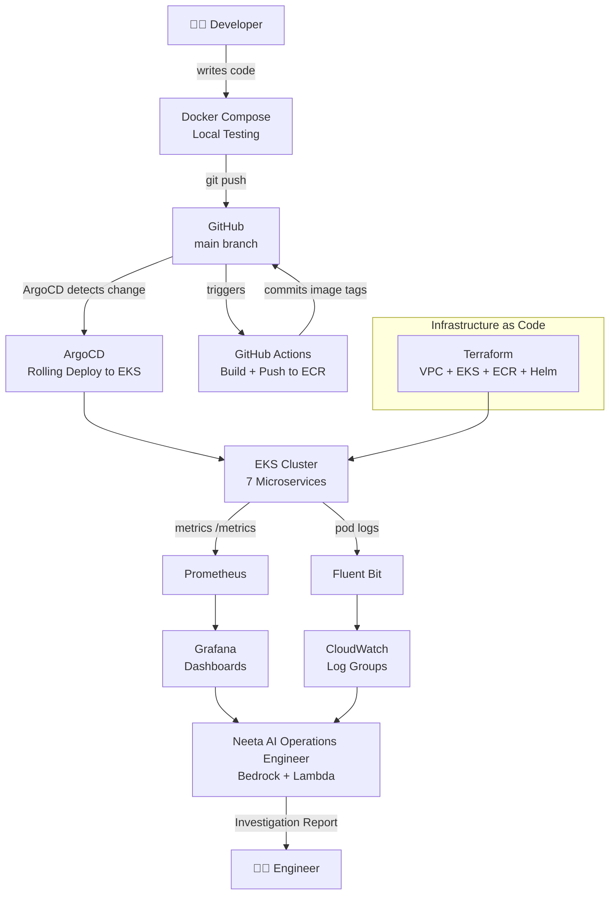
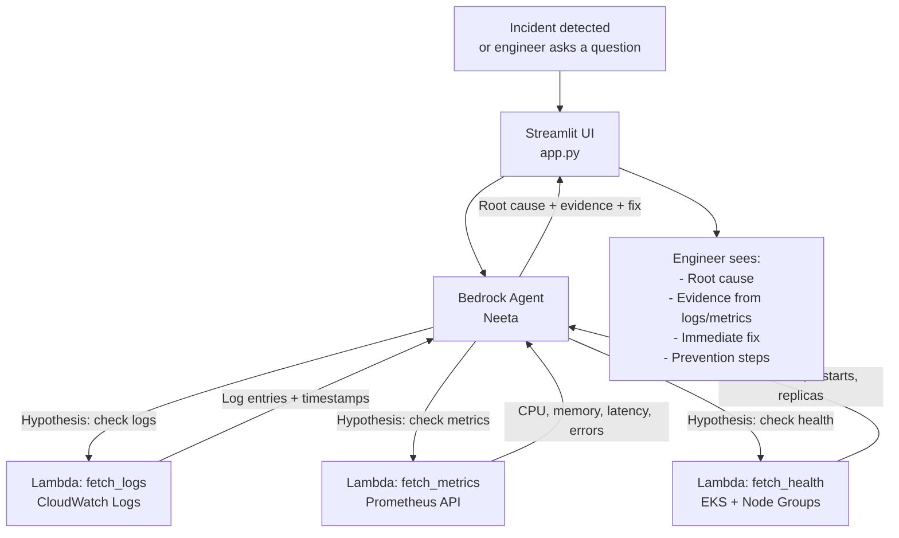

# Neeta AI: AI Operations Engineer for Kubernetes and Cloud Infrastructure

## Overview

Neeta AI is an AI-powered Operations Engineer designed to help developers, platform engineers, and SREs diagnose and resolve issues in Kubernetes-based environments.

Rather than functioning as a traditional chatbot, Neeta acts as an intelligent investigation assistant. It gathers operational context from multiple observability sources, reasons across logs, metrics, deployment history, and Kubernetes events, and provides root-cause analysis along with remediation recommendations.

The system was built to reduce the time engineers spend manually switching between dashboards, logs, deployment tools, and infrastructure consoles during incident investigations.

---

## Problem Statement

Modern cloud-native systems generate large amounts of operational data:

* Application logs
* Infrastructure metrics
* Kubernetes events
* Deployment history
* Git commits
* Cloud monitoring alerts

When incidents occur, engineers often spend considerable time collecting and correlating information from multiple systems before they can identify the root cause.

Neeta was created to centralize this investigation process and accelerate troubleshooting by leveraging foundation models and agentic reasoning workflows.

---

## Architecture

---

## AIOps — Neeta (Bedrock Agent)

**The Neeta workflow:**
1. Engineer describes a symptom
2. Neeta forms a hypothesis
3. Gathers evidence using the 3 Lambda tools (logs, metrics, health)
4. Correlates data across all three sources
5. Returns root cause, supporting evidence, immediate fix, and prevention steps

**Neeta never guesses.** Every conclusion is backed by specific log entries or metric values.

---

## Context Gathering

Neeta collects relevant operational information from multiple sources:

### Metrics

* Prometheus
* Grafana dashboards

### Logs

* Fluent Bit
* Amazon CloudWatch

### Kubernetes Context

* Pod status
* Events
* Deployments
* ReplicaSets
* Health checks

### Deployment Context

* ArgoCD
* GitHub
* Git commit metadata

This allows Neeta to determine whether an issue correlates with a recent deployment or infrastructure change.

---

## AI Architecture

### AWS Bedrock Agents

Responsible for:

* Workflow orchestration
* Context gathering
* Tool execution

### Claude Sonnet

Used for:

* Deep root-cause analysis
* Multi-source reasoning
* Remediation planning

### Qwen3-32B

Used for:

* Alternative hypothesis generation
* Secondary validation
* Cost-efficient reasoning

---

## Investigation Workflow

### Step 1

An engineer reports an issue.

Example:

> "Our API latency increased significantly after today's deployment."

### Step 2

Neeta gathers:

* Prometheus metrics
* CloudWatch logs
* Kubernetes events
* Deployment history
* Git changes

### Step 3

The models analyze the evidence.

Example findings:

* Latency increased immediately after deployment
* Database query count increased significantly
* Connection pool saturation detected

### Step 4

Neeta generates an investigation report.

Example Output:

**Likely Root Cause**

Database connection pool exhaustion introduced in release v1.8.2.

**Supporting Evidence**

* Increased query volume
* Higher connection wait times
* Error spikes after deployment

**Recommended Actions**

1. Roll back deployment
2. Increase connection pool limits
3. Optimize database queries

**Confidence**

95%

---

## Impact

### Operational Impact

* Reduced manual investigation effort
* Faster incident diagnosis
* Improved correlation across logs, metrics, and deployments
* Centralized operational context gathering

### Engineering Impact

* Reduced context switching
* Improved troubleshooting efficiency
* Consistent investigation reports
* Faster root-cause identification

---

## Technology Stack

### Agentic AI

* AWS Bedrock Agents
* Claude Sonnet
* Claude Haiku
* Qwen3-32B
* Multi-Agent Reasoning
* Prompt Engineering
* Tool Calling
* Agent Orchestration

### Cloud & Infrastructure

* Amazon EKS
* Amazon ECR
* AWS Lambda
* Amazon CloudWatch
* Amazon VPC

### DevOps & GitOps

* GitHub Actions
* ArgoCD
* Terraform
* Helm
* Docker
* Kubernetes

### Observability

* Prometheus
* Grafana
* Fluent Bit

---

## Key Takeaway

Neeta demonstrates how AI can augment platform engineering and operations workflows. By combining observability data, deployment history, Kubernetes context, and multiple foundation models, it helps engineers investigate incidents faster and make more informed operational decisions.

The project reflects a practical approach to agentic AI: keeping humans in control while using AI to automate context gathering, reasoning, and recommendation generation.
